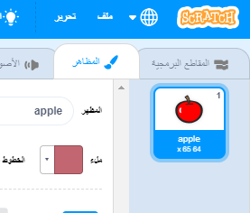
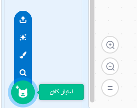

- مع تحديد الكائن الخاص بك، انقر على علامة التبويب المظاهر
    
    

- انقر فوق **اختيار مظهر** واختر أحد الخيارات الخمسة والتي هي من الأسفل إلى الأعلى:
    
    1. اختر مظهر من المكتبة
    2. رسم مظهر جديد
    3. استخدام مظهر عشوائي (مفاجأة)
    4. تحميل المظهر من الملف
    5. زي جديد من الكاميرا
    
    

- إذا كنت ترغب في حذف المظهر المستورد، قم باختياره وانقر على علامة التقاطع الصغيرة في الزاوية اليمنى العلوية.
    
    