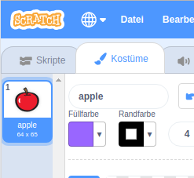
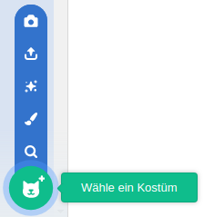
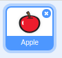

- Klicke bei ausgewählter Figur auf die Registerkarte Kostüme
    
    

- Klicke auf **Wähle ein Kostüm** und wähle eine der fünf Optionen. Von unten nach oben sind das:
    
    1. Wähle ein Kostüm aus der Bibliothek
    2. Male ein neues Kostüm
    3. Verwende ein zufälliges (Überraschungs-) Kostüm
    4. Kostüm aus Datei hochladen
    5. Neues Kostüm von der Kamera
    
    

- Wenn du das importierte Kostüm löschen möchtest, wähle es aus und klicke auf das kleine Kreuz in der oberen rechten Ecke.
    
    