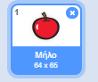

- Έχοντας επιλεγμένο το αντικείμενό σου, κάνε κλικ στην καρτέλα Ενδυμασίες
    
    

- Κάνε κλικ στο ** Επιλέξτε Ενδυμασία** και επίλεξε μια από τις πέντε επιλογές Από κάτω προς τα πάνω είναι:
    
    1. Επιλογή ενδυμασίας από βιβλιοθήκη
    2. Σχεδιασμός νέας ενδυμασίας
    3. Χρήση τυχαίας ενδυμασίας (έκπληξη)
    4. Μεταφόρτωση ενδυμασίας από αρχείο
    5. Νέα ενδυμασία από φωτογραφική μηχανή
    
    

- Εάν επιθυμείς να διαγράψεις την ενδυμασία που εισήγαγες, επίλεξέ την και κάνε κλικ στο μικρό σταυρό στην πάνω δεξιά γωνία.
    
    