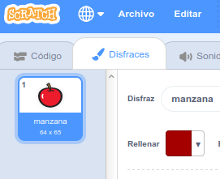
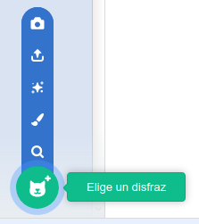
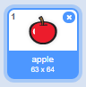

- Con tu objeto seleccionado, haz clic en la pestaña Disfraces
    
    

- Haz clic en **Elige un disfraz** y elige una de las cinco opciones que de abajo a arriba son:
    
    1. Elige un disfraz de la biblioteca
    2. Pinta un disfraz nuevo
    3. Usa un disfraz aleatorio (sorpresa)
    4. Sube un disfraz desde un archivo
    5. Nuevo disfraz desde la cámara
    
    

- Si deseas eliminar el disfraz importado, selecciónalo y haz clic en la pequeña cruz que está en la esquina superior derecha.
    
    