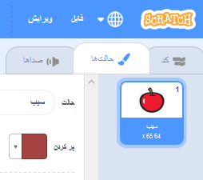
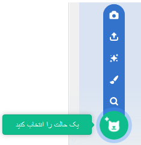
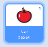

- بعد از انتخاب شکلک خود، بر روی زبانه حالت‌ها کلیک کنید
    
    

- Click **Choose a Costume** and choose one of the five options. From bottom to top they are:
    
    1. از کتابخانه حالت را انتخاب کنید
    2. حالت جدید نقاشی کنید
    3. از یک حالت تصادفی (غافلگیرانه) استفاده کنید
    4. بارگذاری حالت از فایل
    5. حالت جدید از دوربین
    
    

- اگر می‌خواهید حالت وارد شده را حذف کنید، آن را انتخاب کنید و روی ضربدر کوچک در گوشه‌ی بالا سمت راست کلیک کنید.
    
    