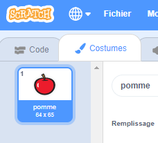

- Avec ton sprite sélectionné, clique sur l'onglet Costumes
    
    

- Clique sur **Choisir un costume** et choisis l'une des cinq options. De bas en haut :
    
    1. Choisir un costume à partir de la bibliothèque
    2. Peindre un nouveau costume
    3. Utiliser un costume aléatoire (surprise)
    4. Importer un costume depuis un fichier
    5. Nouveau costume depuis la webcam
    
    

- Si tu souhaites supprimer le costume importé, sélectionne-le et clique sur la petite croix dans le coin supérieur droit.
    
    