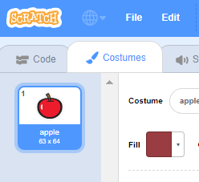

- अपने स्प्राइट का चयन करके, Costumes टैब पर क्लिक करें
    
    

- Click **Choose a Costume** and choose one of the five options. From bottom to top they are:
    
    1. पुस्तकालय से पोशाक चुनें
    2. नई पोशाक पेंट करें
    3. एक यादृच्छिक (आश्चर्य) पोशाक का उपयोग करें
    4. फ़ाइल से पोशाक अपलोड करें
    5. कैमरे से नई पोशाक
    
    

- यदि आप आयातित पोशाक को हटाना चाहते हैं, तो इसे चुनें और ऊपरी दाहिने हाथ के कोने में छोटे क्रॉस पर क्लिक करें।
    
    