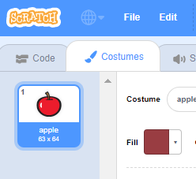

- With your sprite selected, click on the Costumes tab
    
    

- Click **Choose a Costume** and choose one of the five options From bottom to top they are:
    
    1. Choose costume from library
    2. Paint new costume
    3. Use a random (surprise) costume
    4. Upload costume from file
    5. New costume from camera
    
    

- If you wish to delete the imported costume, select it and click on the small cross in the top right hand corner.
    
    