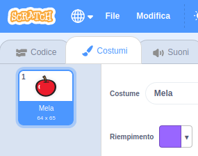
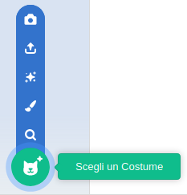
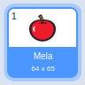

- Con il tuo sprite selezionato, clicca sulla scheda Costumi
    
    

- Clicca su **Scegli un Costume** e scegli una delle cinque opzioni dal basso verso l'alto che sono:
    
    1. Scegli un costume dalla libreria
    2. Disegna un nuovo costume
    3. Scegli un costume a Sorpresa
    4. Importa Costume
    5. Webcam
    
    

- Se desideri eliminare il costume importato, selezionalo e clicca sulla piccola croce in alto a destra.
    
    