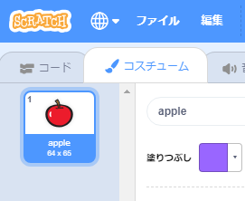
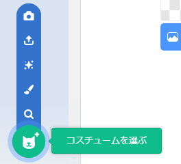

- スプライトを選択 (せんたく) して、コスチュームタブをクリックします
    
    

- **コスチュームを選ぶ** (えらぶ) をクリックし、5つのオプションのいずれかを選択します。下から上にこのようにならんでいます。
    
    1. コスチュームを選ぶ - コスチュームをライブラリから選択
    2. 描く(かく) - 新しいコスチュームを描く
    3. サプライズ - Scratchが選んだ（サプライズ）コスチュームを使う
    4. コスチュームをアップロード - ファイルからコスチュームをアップロードする
    5. カメラ - カメラで新しいコスチュームをさつえいする
    
    

- 取りこんだコスチュームを削除 (さくじょ) したい場合は、コスチュームを選択し、右上の小さな×をクリックします。
    
    