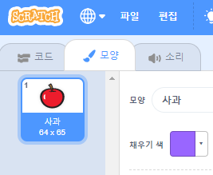
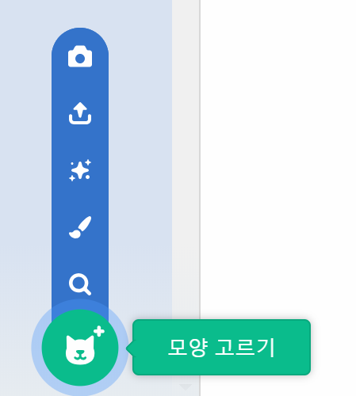

- 스프라이트를 선택한 상태에서 모양 탭을 클릭하세요.
    
    

- Click **Choose a Costume** and choose one of the five options. From bottom to top they are:
    
    1. 라이브러리에서 모양 고르기
    2. 새로운 모양 그리기
    3. 랜덤한 모양(서프라이즈) 사용하기
    4. 파일에서 모양 업로드하기
    5. 카메라로 새 모양 만들기
    
    

- 가져온 모양을 삭제하려면 해당 모양을 선택하고 오른쪽 상단 모서리에 있는 x 표시를 클릭하세요.
    
    