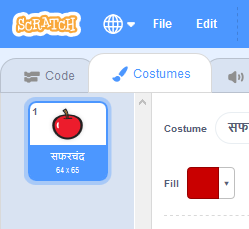
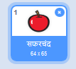

- आपल्या स्प्राइटला निवडून, पोषाख टॅबवर क्लिक करा
    
    

- Click **Choose a Costume** and choose one of the five options From bottom to top they are:
    
    1. लायब्ररीतून पोशाख निवडा
    2. नवीन पोशाख रंगवा
    3. एक यादृच्छिक (आश्चर्यजनक) पोशाख वापरा
    4. फाइल वरून पोशाख अपलोड करा
    5. कॅमेरा पासून नवीन पोशाख
    
    

- जर आपण पोशाख हटवू इच्छित असाल तर त्याला निवडा आणि वरच्या उजव्या कोपऱ्यात असलेल्या लहान क्रॉसवर क्लिक करा.
    
    