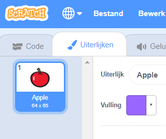
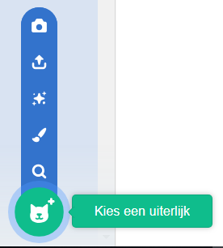
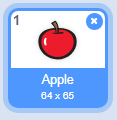

- Selecteer je sprite en klik op het tabblad Uiterlijken
    
    

- Klik op **Kies een uiterlijk** en kies een van de vijf opties. Van onder naar boven zijn deze:
    
    1. Kies een uiterlijk de bibliotheek
    2. Tekenen
    3. Gebruik een verrassing
    4. Upload uiterlijk uit bestand
    5. Nieuw uiterlijk van de camera
    
    

- Als je het geïmporteerde uiterlijk wilt verwijderen, selecteer je het en klik je op het kleine kruisje in de rechterbovenhoek.
    
    