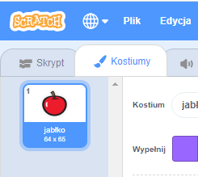
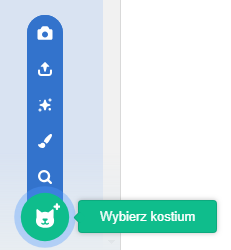
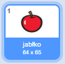

- Po wybraniu duszka, kliknij zakładkę Kostiumy
    
    

- Kliknij **Wybierz kostium** i wybierz jedną z pięciu opcji. Idąc od dołu do góry są to odpowiednio:
    
    1. Wybierz kostium z biblioteki
    2. Namaluj nowy kostium
    3. Użyj losowego (niespodzianka) kostiumu
    4. Wczytaj kostium z pliku
    5. Nowy obraz z aparatu
    
    

- Jeśli chcesz usunąć zaimportowany kostium, wybierz go i kliknij mały krzyżyk w prawym górnym rogu.
    
    