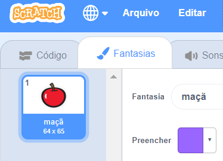
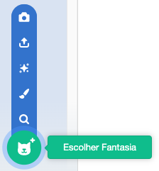
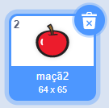

- Com seu ator selecionado, clique na aba Fantasias
    
    

- Click **Choose a Costume** and choose one of the five options. From bottom to top they are:
    
    1. Escolher fantasia da biblioteca
    2. Pintar nova fantasia
    3. Usar uma fantasia aleatória (surpresa)
    4. Carregar fantasia do arquivo
    5. Nova fantasia da câmera
    
    

- Se você deseja excluir a fantasia importada, selecione-a e clique na pequena lixeira no canto superior direito.
    
    