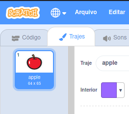
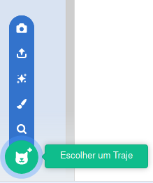

- Com o teu ator selecionado, clique na aba trajes
    
    

- Click **Choose a Costume** and choose one of the five options. From bottom to top they are:
    
    1. Escolher um traje da biblioteca
    2. Pintar novo traje
    3. Usar um traje aleatório (surpresa)
    4. Carregar traje a partir de um ficheiro
    5. Novo traje a partir da câmara
    
    

- Se desejares excluir o traje importado, seleciona-o e clica na pequena cruz no canto superior direito.
    
    