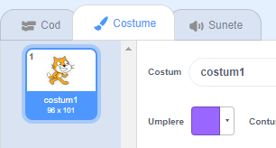
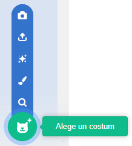

- Cu personajul selectat, dă click pe tab-ul Costume
    
    

- Dă click pe **Chose a Costume** și alege unul dintre cele cinci opțiuni. De jos în sus ele sunt:
    
    1. Alege un costum din librărie
    2. Desenează un costum nou
    3. Folosește un costum la întâmplare (surpriză)
    4. Încarcă un costum dintr-un fișier
    5. Costum nou de la cameră
    
    

- Dacă vrei să ștergi costumul importat, selectează-l și dă click pe crucea mică din colțul din dreapta sus.
    
    