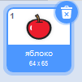

- Выбрав спрайт, перейди на вкладку Костюмы
    
    

- Нажми  **Выберите костюм** и выбери один из пяти вариантов. Снизу вверх они:
    
    1. Выбери костюм из библиотеки
    2. Раскрась новый костюм
    3. Используй случайный (неожиданный) костюм
    4. Загрузить костюм из файла
    5. Новый костюм из камеры
    
    

- Если ты хочешь удалить скачанный костюм, выбери его и нажми на маленький крестик в правом верхнем углу.
    
    