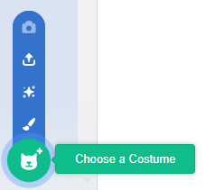

- ඔබේ sprite එක තෝරාගත් පසු, ඇඟලුම් පටිත්ත(costume tab) ක්ලික් කරන්න
    
    

- **ඇඳුමක් තෝරන්න(Choose a Costume)** ක්ලික් කර තේරීම් පහෙන් එකක් තෝරන්න, පහළ සිට ඉහළට ඒවා පහත දක්වා අත :
    
    1. පුස්තකාලයෙන් ඇඳුම්(costume) තෝරන්න
    2. නව ඇඳුමක්(costume) පින්තාරු කරන්න
    3. අහඹු (පුදුම) ඇඳුමක්(costume) භාවිතා කරන්න
    4. ගොනුවක් මගින් ඇඳුමක්(costume) උඩුගත(upload) කරන්න
    5. කැමරාවෙන් නව ඇඳුමක්(costume)
    
    

- ආනයනික ඇඳුම(costume) මකා දැමීමට ඔබට අවශ්‍ය නම්, එය තෝරාගෙන ඉහළ දකුණු කෙළවරේ ඇති කුඩා කතිරය මත ක්ලික් කරන්න.
    
    