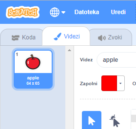
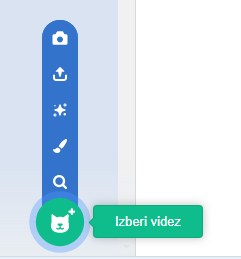

- Ko je izbrana figura, klikni na zavihek Videzi
    
    

- Klikni na **Izberi videz** in izberi katero izmed petih možnosti. Od spodaj navzgor si sledijo kot:
    
    1. Izberi videz iz knjižnice
    2. Nariši nov videz
    3. Uporabi naključni videz (presenečenje)
    4. Naloži videz iz datoteke
    5. Ustvari nov videz s pomočjo kamere
    
    

- Če želiš izbrisati uvoženi videz, ga izberi in klikni na majhen križec v zgornjem desnem kotu.
    
    