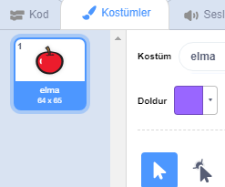
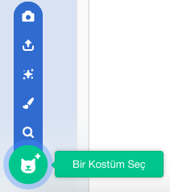
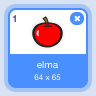

- Kuklanız seçiliyken Kostümler sekmesine tıklayın
    
    

- Click **Choose a Costume** and choose one of the five options. From bottom to top they are:
    
    1. Bir Kostüm Seç -- Kütüphaneden kostüm seçin
    2. Çizim -- Yeni bir kostüm boyayın
    3. Sürpriz -- Rastgele bir kostüm kullanın
    4. Kostüm Yükle -- Dosyadan kostüm yükleyin
    5. Kamera -- Kameradan yeni kostüm
    
    

- Eklediğiniz kostümü silmek istiyorsanız, onu seçin ve sağ üst köşesindeki küçük çarpı işaretini tıklayın.
    
    