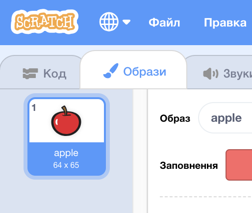
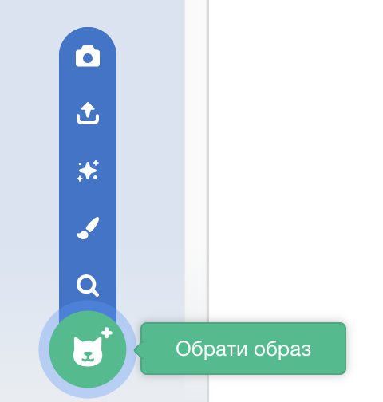

- Вибравши спрайт, натисни на вкладку Образи
    
    

- Click **Choose a Costume** and choose one of the five options. From bottom to top they are:
    
    1. Обрати образ з бібліотеки
    2. Малювати новий образ
    3. Використовувати випадковий образ (сюрприз)
    4. Вивантажити образ із файлу
    5. Новий образ із камери
    
    

- Якщо ти бажаєш видалити імпортований образ, виділи його та клацни на маленький хрестик в правому верхньому куті.
    
    