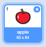

- 选中精灵后，点击 "造型" 选项卡
    
    

- 点击 **选择一个造型** 然后从 5 个选项中挑选一个 从下到上是:
    
    1. 从图库中选择一个造型
    2. 绘制一个新造型
    3. 使用随机 (惊喜) 造型
    4. 上传造型
    5. 用相机拍摄新图像作为造型
    
    

- 如果你想删除上传的造型，选中它然后点击右上角的删除小图标就可以了
    
    