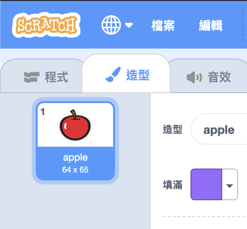
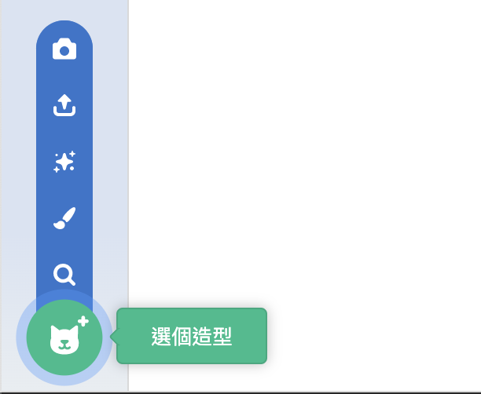

- 選擇精靈後，單按“造型”選項卡
    
    

- 單按 **選擇造型** 然後從五個選項中挑選一個 從下到上分別是：
    
    1. 從圖庫中選擇造型
    2. 繪製新造型
    3. 使用隨機 (驚喜) 造型
    4. 上傳造型檔案
    5. 相機拍攝新圖檔
    
    

- 如要刪除上傳的造型，請在選擇後，單按右上角的小十字。
    
    